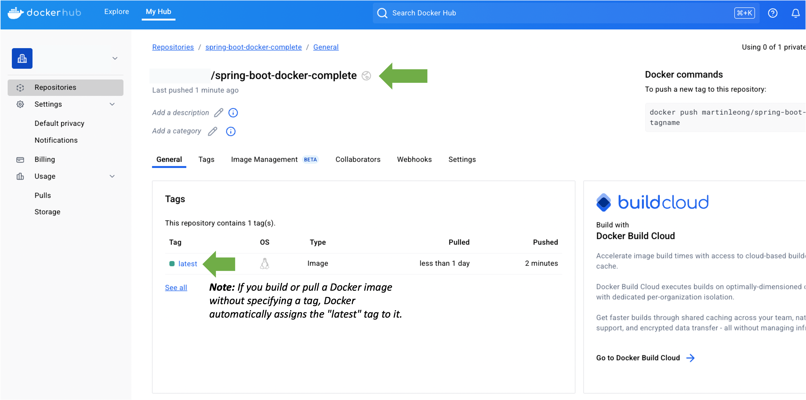
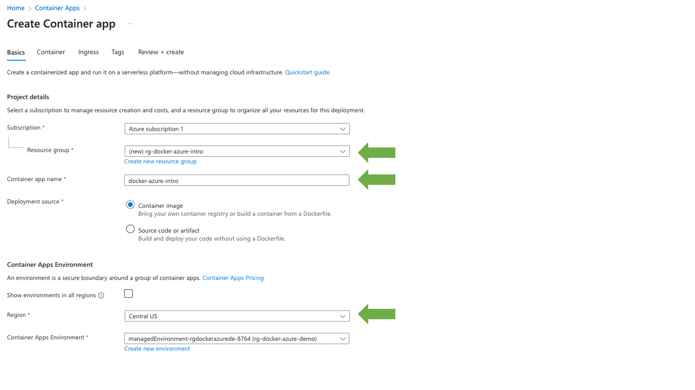
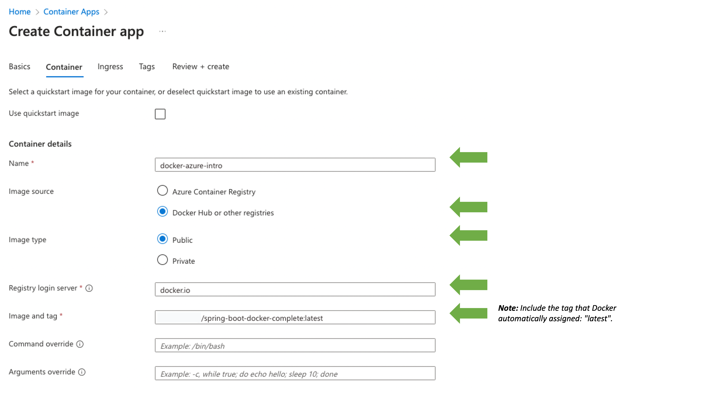
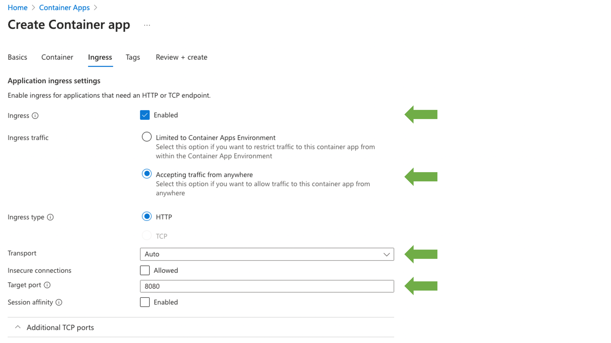
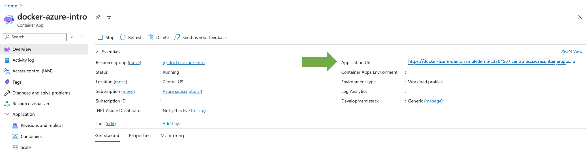

# Docker Class Exercise

## Create your first Docker Image

### Step 1: Hello Docker World

1. In terminal, run the following command to clone the example:

```sh
git clone https://github.com/spring-guides/gs-spring-boot-docker.git
```

2. Next, in terminal, go to the folder: `gs-spring-boot-docker/complete`.

```sh
cd gs-spring-boot-docker/complete
```

3. Examine the following files within the folder:
    - gs-spring-boot-docker/complete/src/main/java/hello/***Application.java***
    - gs-spring-boot-docker/complete/***Dockerfile***

3. In terminal, use the following command line to run the application:

```sh
./mvnw install && java -jar target/spring-boot-docker-complete-0.0.1-SNAPSHOT.jar
```
 
**Note:** For gradle applications, run it with the command: `./gradlew build && java -jar build/libs/complete-0.0.1-SNAPSHOT.jar`

4. Go to [localhost:8080](http://localhost:8080) to see your "Hello Docker World" message.

### Step 2: Containerize It

1. To containerize the example application, update the ***Dockerfile*** for the Spring Boot project:


```dockerfile
FROM maven:3.9.8-eclipse-temurin-21
ARG JAR_FILE=target/*.jar
COPY ${JAR_FILE} app.jar
ENTRYPOINT ["java","-jar","app.jar"]
```

2. Next, to build the image, replace **`<your-docker-account-name>`** with your own Docker account name (repeat this for all other instances below) before running the following command line in the terminal: 
    
```sh
docker build -t <your-docker-account-name>/spring-boot-docker-complete .
```

**Note:** For those building on gradle, run the command: `docker build --build-arg JAR_FILE=build/libs/\*.jar -t your-docker-account-name/spring-boot-docker-complete .`

> **IMPORTANT:** If you're using an ARM-based system (e.g. Apple Silicon M1 or M2), add the option '--platform linux/amd64' to the docker command to avoid runtime errors when deploying to cloud services like Azure, for example: `docker build --platform linux/amd64 -t <your-docker-account-name>/spring-boot-docker-complete .`

3. To run the image in a container, run the following command:

```sh
docker run -p 8080:8080 -t <your-docker-account-name>/spring-boot-docker-complete
```

4. Check out your Docker World Application at [localhost:8080](http://localhost:8080).

Congratulations! You’ve just created a Docker container for a Spring Boot app!


**Tip:** The prefix **`<your-docker-account-name>`** represents your repository name - which you may assign when creating an account on [Docker Hub](https://hub.docker.com). Prepending your repository name to your Docker image (e.g. ***`your-docker-account-name/docker-image-name`***) is a good practice, especially when you plan to push the image to a Docker Registry (e.g. Docker Hub, AWS ECR, GCR, etc).


### Step 3: Deploy to Cloud Computing System

1. Next, push your image to [Docker Hub](https://hub.docker.com/) so that **Azure Container Apps** can pull it to deploy your containerized application. In terminal, sign in to your docker account using the following command line:

```sh
 docker login
```

2. After logging in successfully, enter the following command to [push the image](https://docs.docker.com/get-started/introduction/build-and-push-first-image/) to Docker Hub:

```sh
docker push <your-docker-account-name>/spring-boot-docker-complete
```

3. In the web browser, navigate to [Docker Hub](https://hub.docker.com/) to verify that the image has been published successfully ([see Diagram #1](#diagram-1)). Take note that we will use this published image for deployment on Azure Container Apps.

<a name="diagram-1"></a>**Diagram #1:** Image spring-boot-docker-complete published on Docker Hub.


4. Sign in to the [Azure](https://azure.microsoft.com/) portal (If you don't have an Azure subscription, [create a free account here](https://azure.microsoft.com/en-us/free/students)).
5. Click the **Create a resource** button (the plus-sign in the top left corner).
6. Search for "Container App", select the **Container App** result and click **Create**.
7. Next, configure the following details for the sections below in "Create Container App":
    - **Basic**
        - **Project details** ([see Diagram #2](#diagram-2))
            - [ ] **Resource group (Create new resource group):** _`rg-docker-azure-intro`_
            - [ ] **Container app name:** _`docker-azure-intro`_
            - [ ] **Deployment source:** _`Container Image`_
        - **Container Apps Environment:**
            - [ ] **Region:** _`Central US`_ (or other available regions)
    - **Container**
        - **Container details** ([see Diagram #3](#diagram-3))
            - [ ] **Name:** _`docker-azure-intro`_
            - [ ] **Image source:** _`Docker Hub or other registries`_
            - [ ] **Image type:** _`Public`_ 
            - [ ] **Registry login server:** _`docker.io`_ 
            - [ ] **Image and tag:** _`<your-docker-account-name>/spring-boot-docker-complete:latest`_ 
    - **Ingress**
        - **Application ingress settings** ([see Diagram #4](#diagram-4))
            - [ ] **Ingress:** _[ &#x2713; ]_ _`Enabled`_
            - [ ] **Ingress traffic:** _`Accepting traffic from anywhere`_
            - [ ] **Ingress type:** _`HTTP`_ 
            - [ ] **Transport:** _`auto`_ 
            - [ ] **Target port:** _`8080`_ 
8. Click **Review + create** and then **Create**.
9. When the Container App is deployed, navigate to it in the Azure portal. Copy the **Application URL** ([see Diagram #5](#diagram-5)) and in a web browser, test that the Application Url successfully returns the message "Hello Docker World".

<a name="diagram-2"></a>**Diagram #2:** Create Container App (Basic > Project Details)


<a name="diagram-3"></a>**Diagram #3:** Create Container App (Container > Container details)


<a name="diagram-4"></a>**Diagram #4:** Create Container App (Ingress > Application ingress settings)


<a name="diagram-5"></a>**Diagram #5:** Deployed Container App


Congratulations! You’ve just deployed a Docker container for a Spring Boot app on Azure!